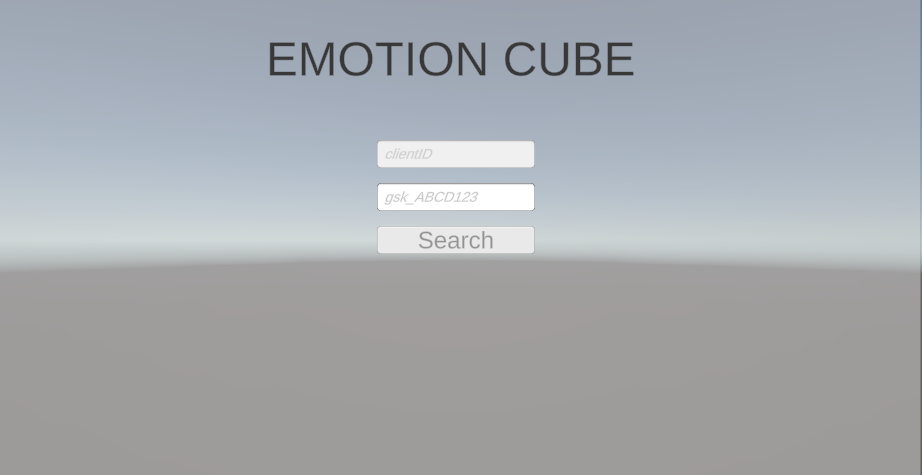
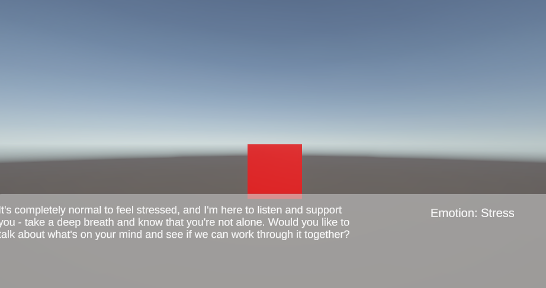
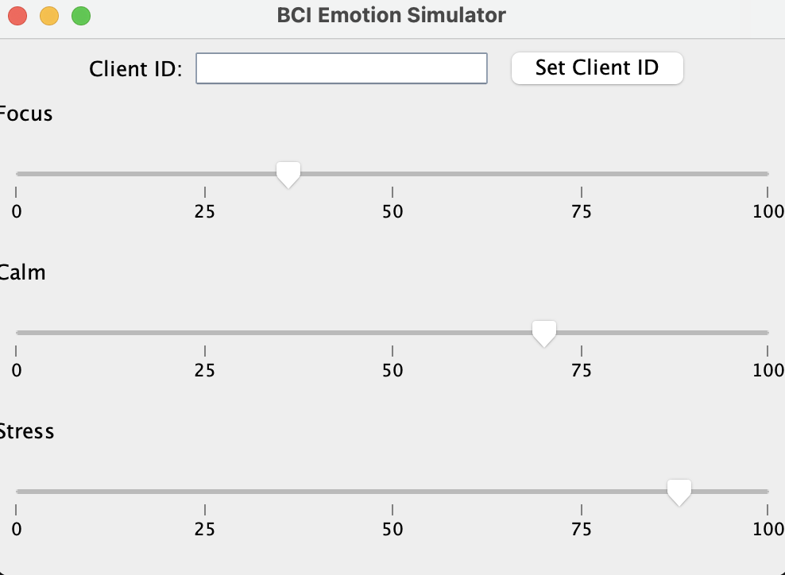
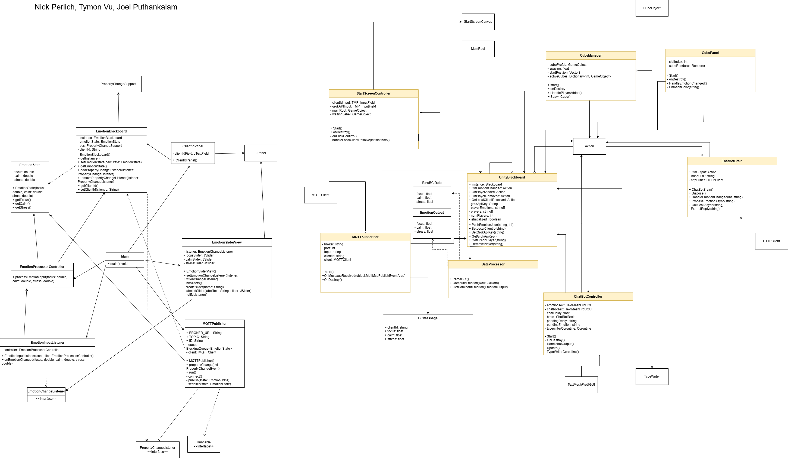
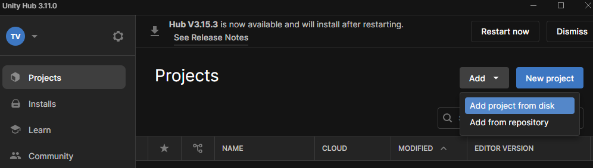

# CSC 508 Final Project: Emotion Cube - Joel Puthankalam, Tymon Vu, and Nicholas Perlich

Our final video is located in either `Final Project Video.mp4` or can be seen within the Youtube Link (https://youtu.be/hKCAz2KY1d8)

## Emotion Cube

EmotionCube is an interactive system that connects a Java-based emotion slider interface with a Unity 3D visualization. Users adjust sliders for focus, stress, and calm, and those values are sent to Unity, where a cube in the scene dynamically changes color based on the dominant emotion. The system also integrates the Grok API, generating context-aware responses or guidance tailored to the user’s current emotional state.



Picture of starting Unity Hub Editor of Emotion Cube Client



PIcture of one user interacting with EmotionCube in Unity



BCI Simulator (Java application) that communicates with to Unity side via MQTT

## UML Diagram



The UML Diagram for the workflow for this project. The left hand side shows the Java side of the application, and the right side shows the Unity side. The architecture follows an MVC pattern with a central Blackboard on both the Unity and Java applications that acts as an observable that other classes can observe and retrieve data from (Observer-Observable pattenr). For the Java and Unity application to communicate, we use the MQTT subscriber pattern and have the Java publish BCI Simulator data to a common broker that Unity can subscribe to and retrieve from.

## How To Run

To run java application program (BCI Simulator), in `EmotionCubeBCISimulator` root directory, make sure you have Maven installed and run:

```
mvn -q clean compile
mvn exec:java
```

This will execute the BCI simulator on Java side that will communicate with the Unity editor.

Then, to run the Unity application program (EmotionCube view):

1. Install [Unity Hub](https://unity.com/download)
2. Install Unity 6 within Unity Hub (we used `Unity6000.0.36f1` because of LTS support)
2. Open project (specifically `EmotionCubeUnity`) to Unity 6 (Make sure to download project and within Unity Hub, do `Add project from disk`)



4. Open up the `Main Scene` in project, by going to `Assets/Scenes/Main Scene`
5. While Java application is running, play the Unity scene

To ensure correct communication between clients, ensure the clientID matches for both the Java application and the Unity application.